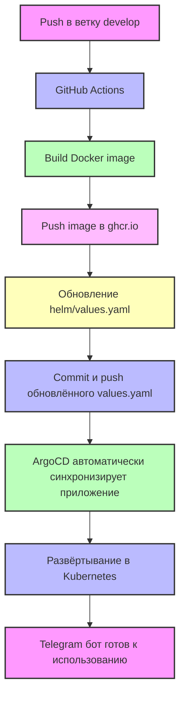

# KBot CI/CD (GitOps вариант)

Автоматизированный CI/CD для Telegram бота с использованием GitHub Actions, Docker, Helm и ArgoCD (GitOps).

---

## 🚀 CI/CD Workflow


---

## 🔹 Настройка GitHub Secrets

- **GITHUB_TOKEN** – создаётся автоматически, проверяем **Read and write permissions**.

> ArgoCD в этом варианте **не требует токена и CLI**, он сам видит изменения в репозитории и синхронизирует deployment.

---

## 🔹 Запуск CI/CD

1. Сделать commit в ветку `develop`:

```bash
git add .
git commit -m "Trigger CI/CD workflow"
git push origin develop
```

2. GitHub Actions автоматически:
- Соберёт Docker image  
- Пушит его в `ghcr.io/<твой_логин>/kbot`  
- Обновит Helm values и закоммитит изменения  

3. ArgoCD автоматически подхватит новые значения и развернёт бота в Kubernetes.

---

## 🔹 Контейнерный образ

Пример адреса:  

```
ghcr.io/den-vasyliev/kbot:v1.0.0-106879e-linux-amd64
```
