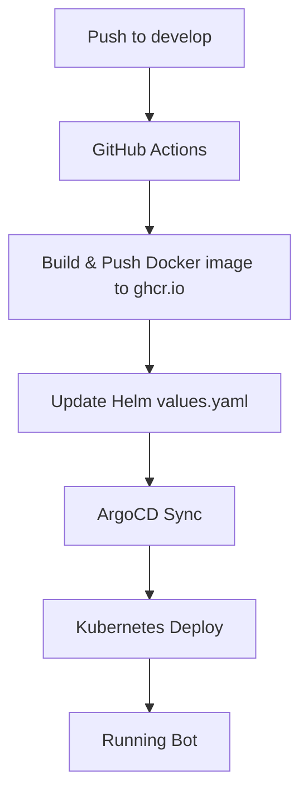

# KBot CI/CD

## 🚀 CI/CD Workflow

```mermaid
flowchart TD
    A[Push to develop] --> B[GitHub Actions]
    B --> C[Build & Push Docker image to ghcr.io]
    C --> D[Update Helm values.yaml]
    D --> E[ArgoCD Sync]
    E --> F[Kubernetes Deploy]
    F --> G[Running Bot]
```
